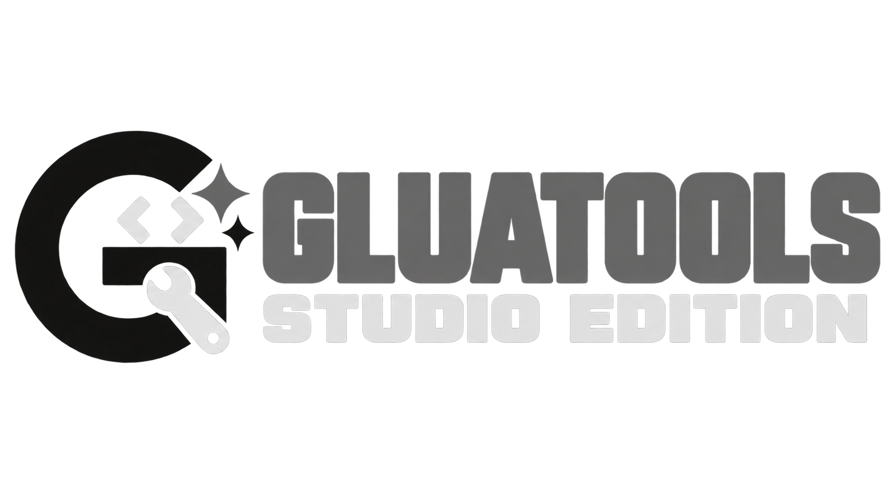

<p align="center">
  
</p>

<p align="center">
  A modern Steam Lua, plugin, manifest, and developer utility.
</p>


# GLuaTools

GLuaTools is a community-driven fork of **LuaTools** focused on improving the Steam Lua and manifest management experience with additional features, fixes, customization, and quality-of-life improvements.

> GLuaTools is an independent fork and is not affiliated with Valve or Steam.

## Features

* Improved LuaTools experience
* Steam Lua management
* Manifest management
* Quality-of-life improvements
* Bug fixes and stability improvements
* Additional customization options
* Cleaner and easier-to-use workflow
* Continued improvements over the original project

## Why GLuaTools?

GLuaTools was created to build on top of LuaTools while keeping the simple utility-focused experience of the original project.

The goal is to:

* Add useful new features
* Fix issues found in the original project
* Improve usability
* Keep the project actively maintained
* Make configuration and management easier

## Installation

1. Download the latest release from the **Releases** page.
2. Extract the downloaded archive.
3. Open the GLuaTools folder.
4. Run the application.
5. Follow the instructions provided inside the program.

Always download GLuaTools directly from the official GitHub repository.

## Updating

When a new version is released:

1. Download the newest release.
2. Replace your existing GLuaTools files.
3. Keep any configuration files you want to preserve.

More convenient update methods may be added in future versions.

## Building From Source

Clone the repository:

```bash
git clone https://github.com/YOUR-USERNAME/GLuaTools.git
```

Enter the project directory:

```bash
cd GLuaTools
```

Then build the project using the development environment and dependencies required by the original LuaTools project.

More detailed build instructions may be added as GLuaTools develops.

## Credits

GLuaTools is based on **LuaTools**.

Huge credit goes to the original LuaTools developers and contributors for creating the project this fork is based on.

If you use or redistribute GLuaTools, please respect the license and attribution requirements of the original project.

## Contributing

Contributions are welcome.

You can help by:

* Reporting bugs
* Suggesting features
* Improving documentation
* Fixing issues
* Submitting pull requests

When reporting a bug, include as much information as possible, such as:

* GLuaTools version
* Operating system
* What you were trying to do
* What happened
* Any error messages or logs

## Disclaimer

GLuaTools is provided as-is.

Use it at your own risk. The developers and contributors are not responsible for account issues, data loss, software problems, or other damage caused by improper use of the program.

GLuaTools is not affiliated with, endorsed by, or sponsored by Valve Corporation, Steam, or the original LuaTools developers.

## License

GLuaTools follows the licensing requirements of the original LuaTools project.

See the `LICENSE` file for more information.

---

### GLuaTools

**A community-driven LuaTools fork with extra features, fixes, and improvements for Steam Lua and manifest management.**
